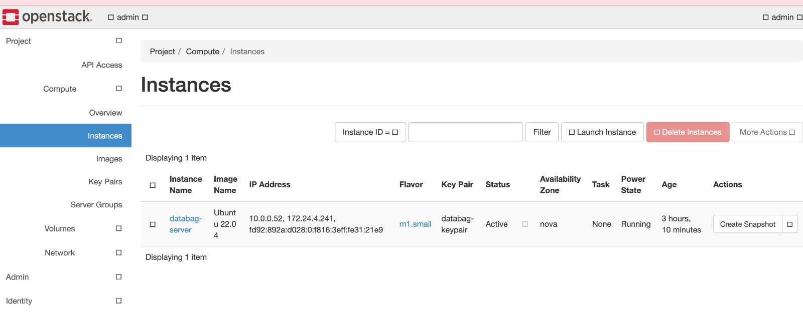
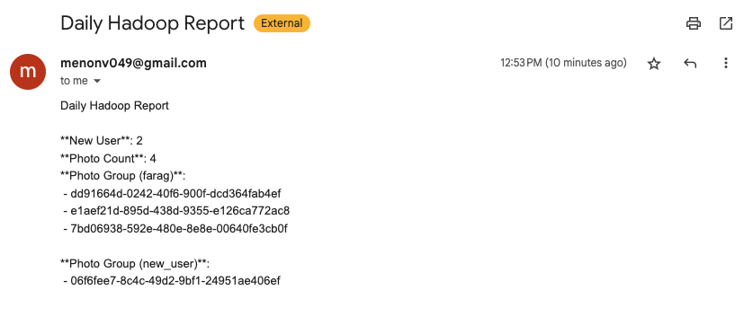

[](https://classroom.github.com/a/YgTxS8yH)

# Arnav Menon (arnavmen) & Sanjeev Sridhar (ssridha3)

## GLOBAL NOTES:
As you're going through with the setup, keep the following in mind:
- wherever you see an IP double check it matches your setup/
- Update `databag/local.conf` with an admin password


## Project Overview
This project implements a cloud-based data processing pipeline using OpenStack as the cloud infrastructure, Databag as the data source, and Hadoop for data processing. The pipeline:

1. Collects user activity data from Databag (a messaging platform)
2. Processes the data using Hadoop MapReduce
3. Generates reports on user activity and photo uploads
4. Sends email notifications with the reports every 24 hours

## Architecture
- Cloud Infrastructure: OpenStack deployed with DevStack
- Data Source: Databag (messaging platform)
- Processing Engine: Hadoop (single-node pseudo-distributed mode)
- Security: SSH key authentication, token-based API access
- Reporting: Email-based reports of activity metrics

For this project you will need 2 dedicated VMs: 1 for databag and 1 for hadoop.

## Devstack Installation on Databag VM

Installation was pretty simple. We used [this](https://docs.openstack.org/devstack/latest/) guide, and followed the steps, and everything went pretty smoothly. 

To use devstack on the VM, follow these steps.

1. `sudo -u stack -i` we need to switch to the user you created during devstack installation. if you followed the guide exactly, the user should be `stack`, but replace with your username.
2. cd into the `devstack` folder and run `source openrc`. this will load the env variables required to interact with openstack CLI.
3. run any/all of the following commands as a sanity check to make sure openstack CLI is working.
```
openstack service list
openstack endpoint list
openstack server list
openstack network list
openstack image list
openstack volume list
```

## Access Devstack Dashboard from Local Machine (Optional)
These steps will create an ssh tunnel from your local machine to the vm openstack is hosted on and allow you to interact with the openstack dashboard from your local machine. Only necessary if your vm doesn't have a GUI.

1. First we need to generate an SSH key pair on local machine. Run this command
```
ssh-keygen -t rsa -b 4096
```
The .pub file is your public key. Copy the contents of it and paste it into the `~/.ssh/authorized_keys` file. ssh into your vm, open the file, and paste the public key into it.

2. Now we can create the ssh tunnel from our local machine to the vm. command is as follows
```
ssh -L <local_port>:<vm_public_ip>:<vm_port> <user>@<external_ip>
```
Replace:
  - `<local_port>` with the port you want to use on your local machine.
  - `<vm_public_ip>` with your VM’s public IP.
  - `<vm_port>` with the port on the VM you want to forward, usually port `80`
  - `<user>` with your VM username, in our case `stack`
  - `<external_ip>` with the VM’s external IP.

3. you should be able to access `http://localhost:<local_port>` on your local machine and be prompted to login to the openstack dashboard. once logged in you should see an interface similar to this


## Creating VM Instance via Terraform in Openstack
This part wasn't too bad. We were able to create the VM instance with terraform very easily, but we were having trouble ssh'ing into it. after scouring documentation and videos online, as well as talking to the prof, we realized that our vm was hosted in one network within openstack but our user was in another. Once we fixed that we were able to ssh in.

Our terraform configuration files:
- `main.tf`: Sets up OpenStack provider and base infra for databag and hadoop VMs
- `hadoop.tf`: Configures Hadoop instance and its services
- `docker-databag.tf`: Sets up and deploys databag app via docker compose.

## Deploy Databag
We will be deploying Databag via a provided docker image. To follow along make sure the `git clone` url in `docker-databag.tf` is pointing to [this](https://github.com/balzack/databag/commit/38a637e5cbfa4d42d66bf8c29e781e9fe8868f3f) commit. First, go to [this](https://hub.docker.com/r/balzack/databag/tags) website and confirm which image you want to build with. We will be using the `latest` image. Before we use `docker-databag.tf` to build and deploy the app, we need to pull the image onto our machine first.
- ```docker pull balzack/databag:latest```
- then we can run `docker-databag.tf` in our Databag VM using the following commands
```
terraform init
terraform plan
terraform apply
```

Once the build has completed, we can do SSH tunneling to access the site from our local machine. First we must create an ssh key on our local machine for our databag vm user. The command is as follows:
```ssh-keygen -t rsa -b 4096 -f stack-ssh-key -C stack```
Copy this public key and add it to ssh-keys in the GCP VM. Now we can use ssh tunneling to access the site on our local machine.

*Note: We must use port 7000 as that is the default port at which databag is deployed*

```
ssh -L 7000:<databag-vm-private-ip>:7000 -i ~/.ssh/my-ssh-key stack@<gcp-vm-external-ip>
```
This will allow you to access the site at `http://localhost:7000`. If this is your first time logging into the app it will ask for the admin to log in. The default password is `password` but this can be changed in the `docker-compose.yml` file before build. Below are some examples showing the UI of Databag.


## Databag Modifications
We extended Databag's functionality with two key features:
1. Admin Token Export: Implemented in `api_exportAdminToken.go` to securely save admin tokens to a file for use by the data pipeline
2. Analytics API: Created a new endpoint in `api_analytics.go` that provides user activity data in JSON format

These modifications enable our data pipeline to securely extract user activity data for processing.


## Hadoop Setup and Configuration
We deployed Hadoop in pseudo-distributed mode on a single VM. Our hadoop.tf configures:
- Java installation
- Hadoop 3.3.5 download and setup
- SSH key configuration for Hadoop services
- HDFS formatting
- Core configuration files setup
- Starting the Hadoop services


## Data Pipeline Implementation
All of the following resides in the hadoop VM.

The data pipeline consists of several components:
1. ### Token Management (token.sh)
- Securely retrieves the admin token from Databag
- Copies it to the processing environment

2. ### Data Collection (fetch_data.py)
- Authenticates with the Databag API using the admin token
- Retrieves user activity data via the analytics endpoint
- Saves the data as a JSONL file for processing

3. ### MapReduce Processing
- **Mapper (`mapper.py`)**: Parses the JSONL data and emits key-value pairs for:
  - New user counts
  - Photo upload counts
  - Photo groupings by username
- **Reducer (`reducer.py`)**: Aggregates the counts and groups by category

4. ### Report Generation and Notification (send_email.py)
- Processes the MapReduce output
- Formats it into a readable report
- Sends the report via email to administrators

5. ### Pipeline Orchestration (pipeline.sh)
- Coordinates the entire workflow
- Handles error conditions
- Provides logging of the process


## Setup Instructions
1. Update network configurations in all files:
  - Where you see an IP address (e.g., 10.10.0.146), double-check it matches your setup
  - Update local.conf with your admin password
2. Create necessary directories:
  ```
  mkdir -p ~/logs
  mkdir -p ~/code/files
  ```
3. Configure email notifications
  - Create `emailConfig.py` in the `files` directory (use `emailConfig.exmaple.py` as an example):
4. Run the pipeline:
```
chmod +x pipeline.sh
./pipeline.sh
```

## Sample Output
The pipeline generates reports in the following format (also see [sample_hadoop_output](hadoop/code/files/data_20250401.example.jsonl))



## Challenges and Lessons Learned
1. Network Configuration: Ensuring the VMs could communicate properly was challenging. We learned the importance of understanding the underlying network architecture of OpenStack.
2. API Modifications: Extending Databag required understanding its Go codebase to add our analytics endpoint.
3. Secure Token Management: We implemented a secure way to handle admin tokens between systems.
4. Hadoop Configuration: Setting up the proper configuration files for Hadoop took some experimentation to get working correctly.
5. Pipeline Orchestration: Coordinating the various components required careful error handling and logging.


## Future Improvements
1. Implement a more robust error handling system with retries
2. Add data visualization for the analytics
3. Expand the MapReduce job to analyze more complex user interactions
4. Implement real-time processing instead of batch processing
5. Add a web dashboard for viewing analytics


## Conclusion
This project demonstrates a complete cloud data processing pipeline using OpenStack, Databag, and Hadoop. It showcases how to extract data from a running application, process it using MapReduce, and deliver actionable insights through email reports.


# Troubleshooting
1. Openstack CLI not working
`Missing value auth-url required for auth plugin password`
If running into this issue, you need to rerun ```source openrc```.
2. ```ForbiddenException: 403: Client Error for url: http://10.128.0.37/identity/v3/role_assignments?scope.project.id=58e61e67e8da4d5a8a21f8202cf94535&user.id=f2c28b7b31d345f09b48906&include_names=True, You are not authorized to perform the requested action: identity:list_role_assignments.```
If running into this issue, you need to run ```source /opt/stack/devstack/openrc admin admin```
3. When you initially create the Databag and Hadoop VM's you will need to allow your VM to resolve DNS. It's a little involved but try the following steps
  You will need to add your server ip and server name to `/etc/hosts` if not already. Then you want to run the following commands to propagate the changes
    ```
    sudo hostnamectl set-hostname <server-name>
    ping <server-name> (verify the fix)

    sudo touch /etc/resolv.conf
    echo "nameserver 8.8.8.8" | sudo tee /etc/resolv.conf
    echo "nameserver 8.8.4.4" | sudo tee -a /etc/resolv.conf

    ping -c 4 google.com (verify DNS resolution now works)
    ```
  4. How to access Databag and Hadoop VMs via floating IP 
    - Openstack assigns an internal basic and floating ip to its VMs so you have to modify the ens5 subnet in `local.conf` to access the floating ips.